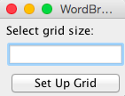
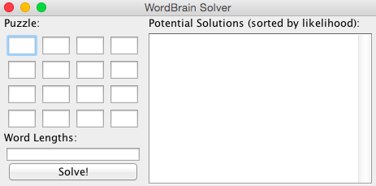
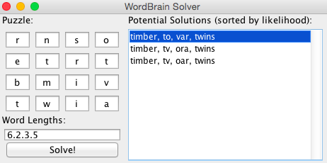

## WordBrain Solver ##

This is a toy project I created for solving puzzles in the iOS game, 'WordBrain'.

### What is WordBrain? ###
WordBrain is a word search like puzzle, where you are presented with a grid of characters, and you must find the word or words contained within. It differs in two ways:
1. Characters do not necessarily need to be connected in a straight line. If a character can reach another character diagonally, they can be used to form a word.
2. Once you have found a word, the characters used to form this word are removed and the remaining characters 'drop down' to fill the void created by the removed characters. This means that for puzzles with multiple words, later words may not become accessible until the first word is found.
3. Once all words are found, all characters in the grid must have been used.
 
WordBrain provides you with the grid, and the length of each word. It's possible to get the right word, but with the wrong characters, meaning you are unable to get later words.

### Notable Features ###

1. Presents complete solutions to the entire grid, not just potential solutions for individual words.
2. Uses a trie to speed up search for valid words through the grid
3. Uses a word frequency corpus to rank potential solutions
4. A UI which:
	- allows puzzles to be entered
	- ranks and displays potential solutions
	- walks through each solution

### How does this solve it? ###

My solution solves a grid by taking in a dictionary of english words, and analyzing a grid of characters, using the lengths of the words required to narrow the search space.
 
The solver performs an exhaustive search of the grid. It starts from each character in the grid and recursively builds all possible combinations of words starting from this character. If it finds a word of the correct length, it removes the characters in this word and starts searching for a word with the next desired length.

I have included two approaches to implementing the dictionary. There is a simple set implementation that adds all words to a `HashSet` and uses the `contains()` call to determine a given string is a word. There is also a Trie implementation (used by default) that provides an additional `isPrefix()` call, which allows the solver to terminate some searches early (if there are no words that begin with the given prefix).  

Once all potential solutions have been found, they are ranked using a corpus of word frequencies to present the most likely solutions first -- this is important, because the dictionary contains a vast number of unusual words that are unlikely to be in a puzzle.

When a word is found, the grid and the positions in the grid are also recorded so that a word can be highlighted in the grid when a solution is shown.

### Running the Solver ###

#### In Java ####

To run the code, you will need Java and Maven installed.

You can see examples of the solver being run in the `SolverTests` class.

First, to create the dictionary, you need to load it from disk into either the `SetDictionary` or the `TrieDictionary`. These are shown below:

	final SetDictionary setDictionary = new SetDictionary(wordSet);
	final TrieDictionary trieDictionary = TrieDictionary.createTrie(wordSet);
   
Then, using one of these dictionaries, initialize the solver class:

	WordGridSolver solver = new WordGridSolver(trieDictionary);
	
To solve a grid, you must provide the grid and a queue of the word lengths required:

	final List<LinkedList<String>> solutions = solver.findWords(grid, wordLengths);

This call returns a list of of lists, where the inner list is a set of words that make up a valid solution. This inner list is ordered, so the first entry in the list may be required before the next entry becomes available on the grid. 

#### On The UI ####

To run the program through maven, use the following commands to compile and start:

	mvn compile
	java -Dexec.mainClass="nyc.angus.wordgrid.StartSolverUi"

Once started you will see the following frame, allowing you to select the size of the grid being played:

Upon selection of a grid, the grid entry pages pops up:

This form allows you to fill out the grid and enter the lengths of the words being searched as comma separated values.

Finally, when everything has been entered, solutions to the puzzle are shown on the list to the right:

Each potential solution can be selected to show where the words in the solution appear:

As each word is selected, the grid is updated to remove the characters from the previous grid:

### Credits ###

- Word frequencies for the ranker are from [wordfrequency.info](http://www.wordfrequency.info/top5000.asp).
- The dictionary for the solver is from [stanford.edu](http://web.stanford.edu/class/cs106l/assignments/dictionary.txt).
   